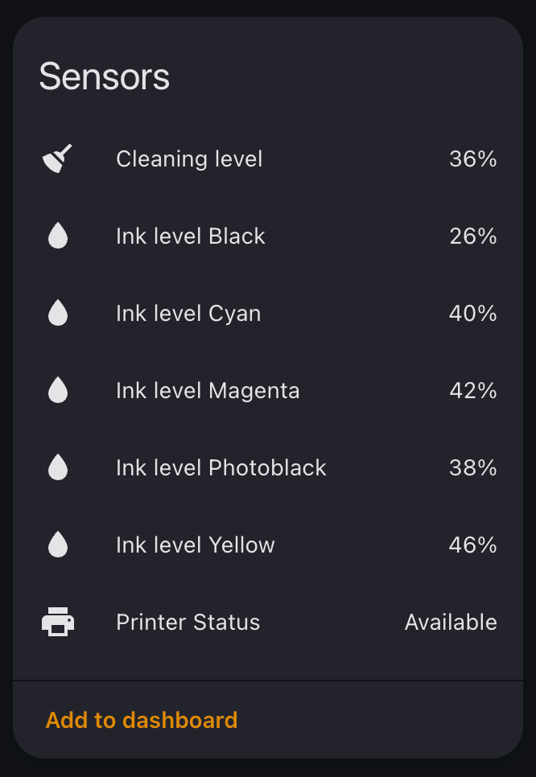

> [!IMPORTANT]
> Before setting up the integration, ensure your Epson WorkForce or EcoTank printer is connected to your network and accessible via HTTP. Visit `http://YOUR_PRINTER_IP/PRESENTATION/HTML/TOP/PRTINFO.HTML` to verify compatibility.

# Epson WorkForce Integration for Home Assistant

### Printer Monitoring Made Simple
#### Monitor your Epson printer's ink levels and status directly in Home Assistant

* Real-time ink level monitoring for all cartridge colors
* Automatic sensor detection (only creates sensors for available cartridges)
* Printer status monitoring
* Easy UI-based configuration
* Professional Epson branding integration



### Supported Devices

**Epson printer series likely to work:**

* WorkForce: WF-26xx, WF-27xx, WF-35xx, WF-36xx, WF-48xx, WF-77xx, WF-78xx
* EcoTank: ET-26xx, ET-27xx, ET-47xx, ET-48xx, ET-51xx, ET-77xx
* Expression: XP-8xx, XP-21xx, XP-22xx

**Confirmed working:**

* WorkForce: WF-2630, WF-2660, WF-2760, WF-3540, WF-3620, WF-3640, WF-4820, WF-7720, WF-7830, WF-7840
* EcoTank: ET-2650, ET-2750, ET-4750, ET-4800, ET-4950, ET-5150, ET-77x0, ET-8500, L6270
* Expression: XP-860, XP-2100, XP-2105, XP-2150, XP-2205

> [!NOTE]
> Please [open an issue](https://github.com/lymanepp/ha-epson-workforce/issues/new) only if you have:
>
> * A printer from an **Epson series not listed above** (working or not), or  
> * A confirmed failure with a listed-series model, including logs and the printer status page HTML.
>
> Please do **not** open issues to report additional working models within the listed series.

### Requirements

* Printer must be connected to your network
* Printer must serve ink level information via HTTP
* Default status page: `/PRESENTATION/HTML/TOP/PRTINFO.HTML`

## Installation

### Via [HACS](https://hacs.xyz/)
<a href="https://my.home-assistant.io/redirect/hacs_repository/?owner=lymanepp&repository=ha-epson-workforce&category=integration" target="_blank"></a>

### Manually

Get the folder `custom_components/epson_workforce` in your HA `config/custom_components`

## Configuration
<a href="https://my.home-assistant.io/redirect/config_flow_start/?domain=epson_workforce" target="_blank"></a>

* Enter your printer's IP address and optionally adjust the status page path.

> [!TIP]
> **Finding Your Printer's IP Address:**
> * Check your router's admin panel for connected devices
> * Use your printer's display panel (Network Settings → TCP/IP)
> * Check the Epson printer software on your computer

## Sensor Naming

Sensors are automatically created for each available ink cartridge and printer status. They are named in the format `Ink level {Color}` for cartridges and `Printer Status` for the overall printer state.

The integration automatically detects and creates sensors for:

* **Ink Levels**: Black, Photo Black, Cyan, Magenta, Yellow, Light Cyan, Light Magenta
* **Maintenance**: Cleaning cartridge level
* **Status**: Overall printer status

> [!NOTE]
> Only sensors available on your specific printer model will be created. The integration queries your printer and only adds sensors for cartridges that are detected.

Example sensor names:
* `sensor.epson123456_ink_level_black`
* `sensor.epson123456_printer_status`
* `sensor.epson123456_cleaning_level`
* `sensor.epson123456_wifi_network`

## Troubleshooting

To troubleshoot your Home Assistant instance, you can add the following configuration to your configuration.yaml file:

```yaml
logger:
  default: warning  # Default log level for all components
  logs:
    custom_components.epson_workforce: debug    # Enable debug logging for this integration
```

> [!WARNING]
> **Common Issues:**
> * Ensure the printer is powered on and connected to your network
> * Verify the printer IP address is correct
> * Try accessing `http://YOUR_PRINTER_IP/PRESENTATION/HTML/TOP/PRTINFO.HTML` directly in your browser
> * Check Home Assistant logs for any error messages
> * Some cartridge types may not be available on all printer models
