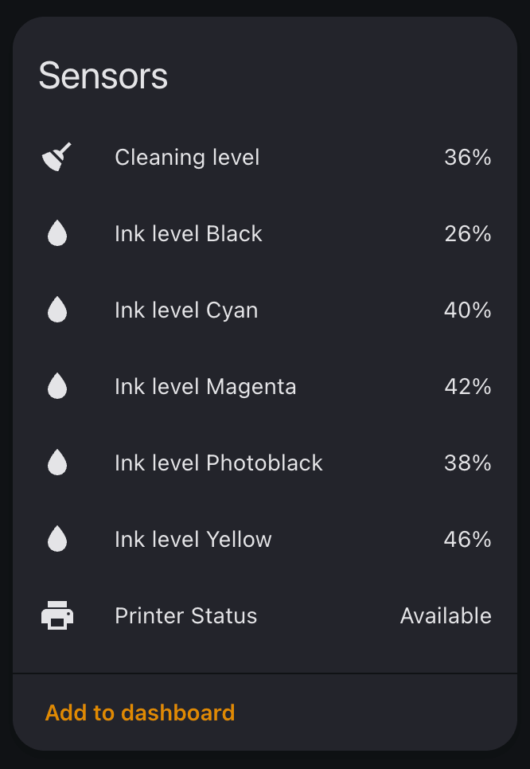

# Epson WorkForce Integration for Home Assistant

Monitor your Epson printer's ink levels, status, and usage statistics directly in Home Assistant.



## Supported Printers

The integration works with any Epson printer that serves a status page over HTTP. The following series are confirmed working or very likely to work:

| Series | Models |
|---|---|
| WorkForce | WF-26xx, WF-27xx, WF-28xx, WF-35xx, WF-36xx, WF-48xx, WF-77xx, WF-78xx |
| EcoTank | ET-26xx, ET-27xx, ET-28xx, ET-47xx, ET-48xx, ET-49xx, ET-51xx, ET-77xx, ET-85xx, L-series |
| Expression | XP-8xx, XP-21xx, XP-22xx |

**Confirmed working:** WF-2630, WF-2660, WF-2760, WF-2835, WF-3540, WF-3620, WF-3640, WF-4820, WF-7720, WF-7830, WF-7840, ET-2650, ET-2750, ET-2820, ET-4750, ET-4800, ET-4950, ET-5150, ET-7700, ET-7750, ET-8500, L6270, XP-860, XP-2100, XP-2105, XP-2150, XP-2205

**To verify your printer is compatible**, open a browser and visit:
```
http://YOUR_PRINTER_IP/PRESENTATION/HTML/TOP/PRTINFO.HTML
```
If you see a status page with ink levels, the integration will work.

> [!NOTE]
> Please [open an issue](https://github.com/lymanepp/ha-epson-workforce/issues/new) only if you have a printer from a series not listed above, or a confirmed failure on a listed model (include logs and the printer status page HTML). Do not open issues to report additional working models within a listed series.

## Installation

### Via [HACS](https://hacs.xyz/) (recommended)

<a href="https://my.home-assistant.io/redirect/hacs_repository/?owner=lymanepp&repository=ha-epson-workforce&category=integration" target="_blank"></a>

### Manually

Copy the `custom_components/epson_workforce` folder into your HA `config/custom_components` directory and restart Home Assistant.

## Configuration

<a href="https://my.home-assistant.io/redirect/config_flow_start/?domain=epson_workforce" target="_blank"></a>

Enter your printer's IP address when prompted. The integration will connect, detect available sensors, and start polling every 60 seconds.

> [!TIP]
> **Finding your printer's IP address:**
> - Check your router's admin panel under connected devices
> - On the printer's display panel: **Settings → Network Settings → TCP/IP**
> - Print a network status sheet from the printer's menu
> - Assign a static IP or DHCP reservation in your router to prevent the address from changing

## Sensors

Sensors are created automatically based on what your specific printer reports. Sensors that are not available on your printer (e.g. a fax status sensor on a non-fax model) are simply not created.

### Enabled by default

| Sensor | Description |
|---|---|
| Ink level Black/Cyan/Magenta/Yellow/etc. | Ink or pigment level per cartridge, 0–100% |
| Cleaning level | Maintenance box / waste ink pad level, 0–100% |
| Printer Status | Overall printer status (e.g. *Available*, *Printing*) |
| Scanner Status | Scanner status on all-in-one models |
| Fax Status | Fax hardware status on fax-capable models |
| Total/B&W/Color Pages Printed | Cumulative page counters since first use |
| B&W/Color Scans | Cumulative scan counters |

### Disabled by default

These sensors are created but hidden in the HA UI by default. Enable them individually under **Settings → Devices & Services → Epson → [your printer] → [sensor] → Enable**. They are disabled because they rarely change and have limited automation value.

| Sensor | Description |
|---|---|
| IP Address | Printer's current IP address |
| Signal Strength | WiFi signal quality (e.g. *Excellent*) |
| WiFi Network | SSID of the connected network |
| WiFi Speed | Link speed (e.g. *433 Mbps*) |
| WiFi Channel | WiFi channel number |
| WiFi Mode | WiFi protocol (e.g. *IEEE 802.11 a/n/ac*) |
| WiFi Security | Security protocol (e.g. *WPA3-SAE(AES)*) |
| WiFi Direct Connection | WiFi Direct connection method |
| WiFi Hardware Status | WiFi hardware health |
| First Print Date | Date of first print job |

## Troubleshooting

### Enable debug logging

Add this to your `configuration.yaml` and restart Home Assistant:

```yaml
logger:
  logs:
    custom_components.epson_workforce: debug
```

With debug logging enabled, every HTTP request to the printer is logged with its URL, response code, and byte count. You will also see which sensors were detected and which supplemental pages your printer supports. Look for these in **Settings → System → Logs**.

### Supplemental pages

In addition to the main status page, the integration attempts to fetch three supplemental pages that expose page counters, extended network details, and hardware status:

```
/PRESENTATION/ADVANCED/INFO_MENTINFO/TOP   (page counters)
/PRESENTATION/ADVANCED/INFO_NWINFO/TOP     (extended network info)
/PRESENTATION/ADVANCED/INFO_BEHAVIORINFO/TOP  (hardware status)
```

These pages return 404 on older or lower-end models. That is normal — the integration detects this on the first poll and stops requesting those pages. The corresponding sensors simply will not be created.

### Common issues

**No sensors created after setup**
The integration connected during setup (otherwise setup would have failed) but the printer became unreachable before the first poll. Check that the printer is on and accessible at `http://YOUR_PRINTER_IP/PRESENTATION/HTML/TOP/PRTINFO.HTML`. Enable debug logging to see what is happening on each poll.

**Ink levels missing for some cartridges**
Not all cartridge slots are present on all printers. The integration only creates sensors for cartridges it detects in the printer's status page. A missing cartridge sensor means that ink type is not in your printer.

**Page counter sensors not appearing**
Your printer does not expose the supplemental usage status page. Enable debug logging — you will see a "404; this page is not available on this printer" line confirming this.

**Printer IP address changed**
Assign a static IP or DHCP reservation for your printer in your router, then remove and re-add the integration with the new address.

**Sensors unavailable after printer power-off**
This is expected. The coordinator marks sensors unavailable when the printer cannot be reached, and restores them automatically when the printer comes back online.
